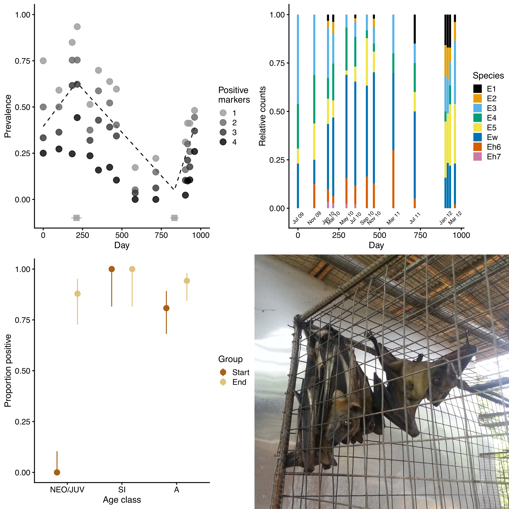

# eidolon_captive_bartonella

Includes data and code for the analysis of *Bartonella* prevalence and diversity in bats (*Eidolon helvum*) and bat flies (*Cyclopodia greefi*) in a captive colony in Ghana, 2009–2012.

